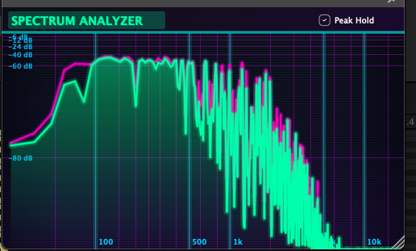

# Spectrum Analyzer



高精度なリアルタイムスペクトラムアナライザプラグイン。JUCEフレームワークで構築された、サイバーパンク風の未来的なビジュアルが特徴です。

## ✨ 特徴

### 解析エンジン
- **FFTサイズ**: 4096サンプル（高精度解析）
- **窓関数**: Hann窓による滑らかな周波数分解
- **スレッドセーフ**: オーディオスレッドからGUIスレッドへの安全なデータ転送
- **60fps更新**: 滑らかなリアルタイム表示

### スペクトラム表示
- **周波数軸**: 20Hz〜20kHz（対数スケール）
- **振幅軸**: 0dB〜-100dB（非線形スケール、上部圧縮）
- **周波数マーカー**: 50Hz刻みの詳細なグリッド表示

### ピークホールド機能
- 各周波数帯域の最大値を保持
- ゆっくりと減衰するピークライン
- ワンクリックでオン/オフ切り替え

### サイバーパンクUI
- ネオングロー効果
- グラデーション背景
- スキャンライン効果
- シアン/マゼンタのネオンカラースキーム

## 🎨 カラースキーム

| 要素 | カラー |
|------|--------|
| メインスペクトラム | ネオングリーン/シアン |
| ピークライン | ホットピンク/マゼンタ |
| 背景 | ディープスペースブラック → ダークパープル |
| グリッド | ネオンマゼンタ/シアン |

## 🛠️ ビルド方法

### 必要条件
- CMake 3.22以上
- C++20対応コンパイラ
- JUCE Framework（`~/JUCE`に配置されていることを想定）

### ビルド手順

```bash
# プロジェクトディレクトリに移動
cd /path/to/Visualizer

# ビルドディレクトリ作成
mkdir -p build && cd build

# CMake設定（JUCEパスをカスタマイズする場合）
cmake .. -DJUCE_PATH=/path/to/JUCE

# ビルド
cmake --build . --config Release -j8
```

### 出力フォーマット
- **VST3**: `build/SpectrumAnalyzer_artefacts/VST3/Spectrum Analyzer.vst3`
- **AU**: `build/SpectrumAnalyzer_artefacts/AU/Spectrum Analyzer.component`
- **Standalone**: `build/SpectrumAnalyzer_artefacts/Standalone/Spectrum Analyzer.app`

ビルド後、VST3とAUプラグインは自動的にシステムのプラグインフォルダにインストールされます。

## 📁 プロジェクト構造

```
Visualizer/
├── CMakeLists.txt                 # ビルド設定
├── README.md                      # このファイル
├── docs/
│   └── screenshot.png             # スクリーンショット
└── Source/
    ├── PluginProcessor.h/cpp      # オーディオ処理・FFT解析
    ├── PluginEditor.h/cpp         # UIレイアウト
    └── SpectrumAnalyzerComponent.h/cpp  # スペクトラム描画
```

## 🎛️ 使い方

1. **Standaloneアプリ**として起動、またはDAWにVST3/AUプラグインをロード
2. オーディオ入力を設定（Standaloneの場合はOptions → Audio/MIDI Settings）
3. オーディオを再生してリアルタイムスペクトラムを確認
4. **Peak Hold**ボタンでピークラインの表示/非表示を切り替え

## 📊 技術仕様

| 項目 | 仕様 |
|------|------|
| FFTサイズ | 4096サンプル |
| 窓関数 | Hann窓 |
| 周波数範囲 | 20Hz - 20kHz |
| ダイナミックレンジ | 100dB |
| 更新レート | 60fps |
| ピーク減衰 | 約0.3dB/フレーム |

## 📄 ライセンス

MIT License

## 🙏 謝辞

- [JUCE Framework](https://juce.com/) - オーディオアプリケーション開発フレームワーク
